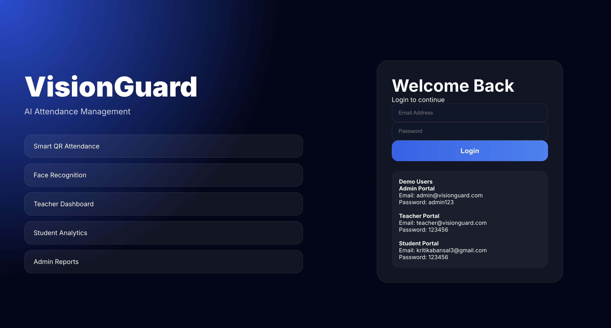
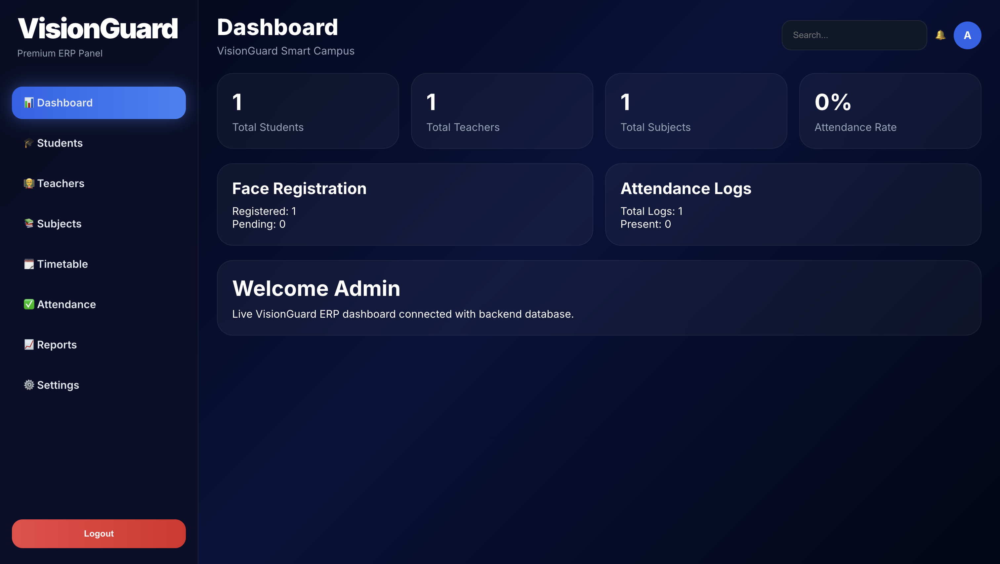
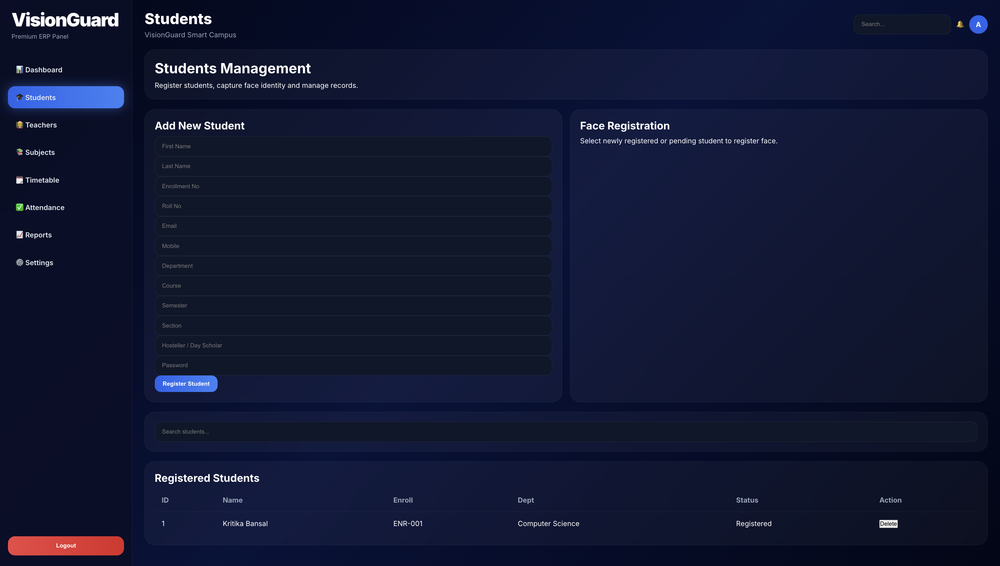
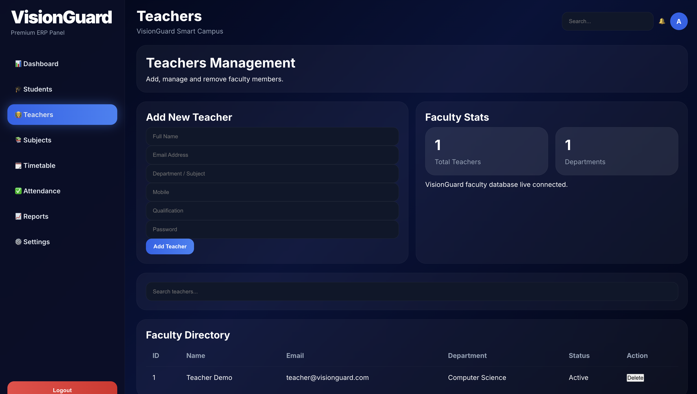
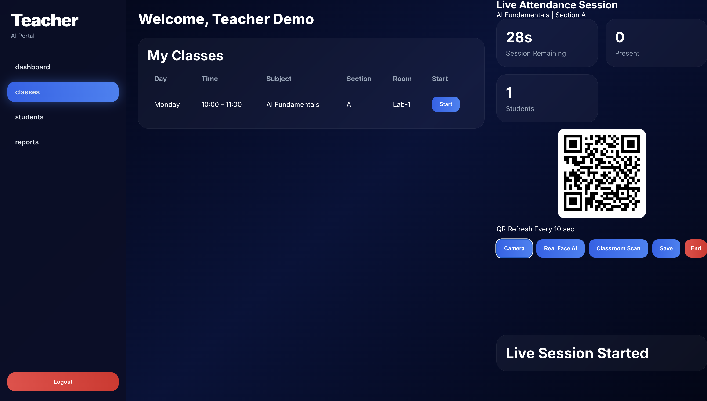

<div align="center">

# 🎓 VisionGuard Smart Campus

### AI-Powered Attendance Management Platform for Modern Institutions

<p>
  <a href="https://frontend-one-blush-51.vercel.app/">
    
  </a>
  <a href="https://visionguard-smart-campus-production.up.railway.app/">
    
  </a>
  <a href="https://visionguard-smart-campus-production.up.railway.app/docs">
    
  </a>
</p>

<p>
  
  
  
  
  
</p>

*A modern full-stack campus management system for handling attendance, students, teachers, schedules, analytics, and smart authentication workflows.*

</div>

---

## 🌐 Live Deployment

| Service | Link |
|--------|------|
| 🖥️ Frontend | https://vision-guard-smart-campus-gelywtdlv-kritikas-projects-85137cfb.vercel.app/|
| ⚙️ Backend API | https://visionguard-smart-campus-production.up.railway.app/ |
| 📘 Swagger Docs | https://visionguard-smart-campus-production.up.railway.app/docs |

---

## 📸 Application Preview

### 🔐 Login Page


### 📊 Admin Dashboard


### 👨🎓 Student Management


### 👩🏫 Teacher Management


### 📷 QR Attendance System


---

## 🚀 Core Features

### 🔐 Authentication & Access Control
- Secure role-based login system
- Admin / Teacher / Student access levels
- Protected dashboard routes

### 👨💼 Admin Dashboard
- Manage complete campus operations
- Real-time insights and statistics
- Centralized control panel

### 👨🎓 Student Management
- Add / edit / delete students
- Attendance history tracking
- Organized searchable records

### 👩🏫 Teacher Management
- Faculty records management
- Subject and class assignment support

### 📚 Subject & Timetable Management
- Subject creation and organization
- Structured class scheduling

### 📷 Smart Attendance System
- QR code based attendance
- Manual attendance support
- Face recognition ready architecture

### 📊 Reports & Analytics
- Present / absent summaries
- Attendance logs
- Dashboard metrics and trends

---

## 🛠️ Technology Stack

| Layer | Technologies |
|------|-------------|
| Frontend | React.js, React Router, Axios, CSS3 |
| Backend | FastAPI, Python, SQLAlchemy |
| Database | MySQL |
| Deployment | Vercel, Railway |

---

## 🏗️ System Architecture

```text
React Frontend
      ↓
FastAPI REST API
      ↓
MySQL Database
```

## 📁 Project Structure

```text
VisionGuard-Smart-Campus/
├── frontend/
│   ├── public/
│   ├── src/
│   └── package.json
│
├── backend/
│   ├── app/
│   ├── requirements.txt
│   └── main.py
│
├── screenshots/
│   ├── login.png
│   ├── dashboard.png
│   ├── students.png
│   ├── teachers.png
│   └── attendance.png
│
└── README.md
```

## ⚙️ Local Development Setup

### 1️⃣ Clone Repository
```bash
git clone https://github.com/kritika038/VisionGuard-Smart-Campus.git
cd VisionGuard-Smart-Campus
```

### 2️⃣ Frontend Setup
```bash
cd frontend
npm install
npm start
```
Frontend runs at: `http://localhost:3000`

### 3️⃣ Backend Setup
```bash
cd backend
pip install -r requirements.txt
uvicorn app.main:app --reload
```
Backend runs at: `http://localhost:8000`

## 🔌 Important API Endpoints

| Method | Endpoint | Purpose |
|--------|----------|---------|
| POST | `/auth/login` | User login |
| GET | `/students/` | Get students |
| GET | `/teachers/` | Get teachers |
| GET | `/subjects/` | Get subjects |
| GET | `/attendance/` | Get attendance |
| GET | `/health` | Health check |

## 🔐 Demo Credentials

**Admin**
- Email: `admin@visionguard.com`
- Password: `admin123`

**Teacher**
- Email: `teacher@visionguard.com`
- Password: `123456`

**Student**
- Email: `kritikabansal3@gmail.com`
- Password: `123456`

## 🎯 Future Enhancements

- [ ] AI Face Recognition Attendance
- [ ] Export Reports (PDF / Excel)
- [ ] Email Notifications
- [ ] Multi-campus Support
- [ ] Mobile Application
- [ ] Advanced Analytics Dashboard

---

## 👩💻 Developed By

**Kritika**

<div align="center">
⭐ If you found this project valuable, consider starring the repository.
</div>
